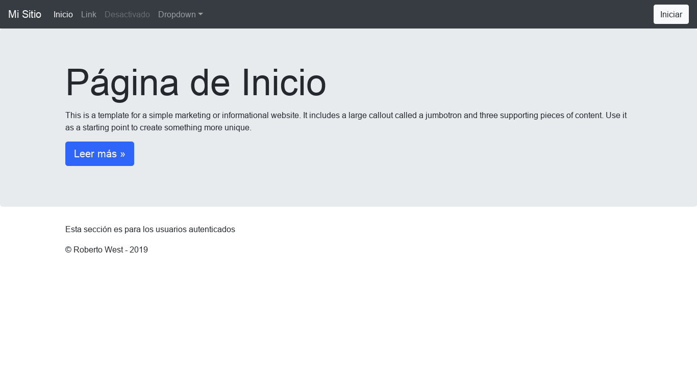
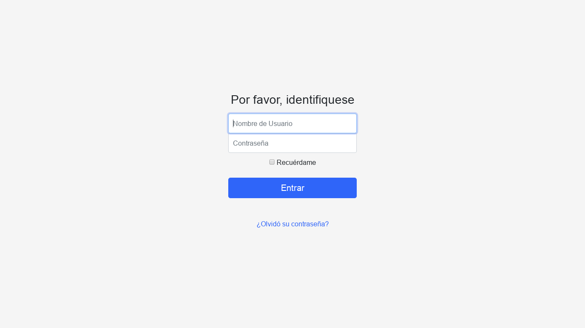
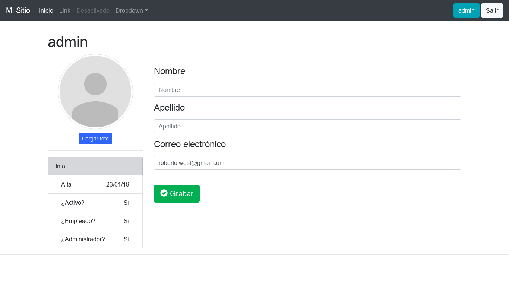

# django2-esqueleto

Esqueleto inicial para mis proyectos creados en Django 2.x

## Comenzando 🚀

Estas instrucciones te permitirán obtener una copia del proyecto en funcionamiento en tu máquina local para propósitos de desarrollo y pruebas.

Mira **Deployment** para conocer como desplegar el proyecto.


### Pre-requisitos 📋

Este proyeto no tiene requisitos adicionales, solo es necesaria la instalación de [Python 3](https://www.python.org) y [django 2](https://www.djangoproject.com).

_En mi caso tengo el siguiente entorno:_

* Debian 9
* Python 3.5.3
* Django 2.1.5

_Instalado de la siguiente manera:_

```
sudo apt install python3
pip install django
```

### Instalación 🔧

La instalación de este proyecto es muy sencilla, solo tendrás que copiar los archivos en tu directorio de trabajo

_De todas maneras describiré a continuación los pasos para crear un proyecto con el fin de recordarme a mi mismo como lo hago ..._

```
$ mkdir -p ~/Desarrollo/Django/mi_proyecto
$ cd ~/Desarrollo/Django/mi_proyecto
$ django-admin startproject config .
$ mkdir apps
$ mkdir templates
```

## Ejecutando las pruebas ⚙️

El usuario de la base de datos sqlite es admin con contraseña admin, igualmente pueden eliminar la base de datos y volver a realizar la miración.

Estas son las direcciones habilitadas

http://localhost:8000

http://localhost:8000/login

http://localhost:8000/logout

http://localhost:8000/register

http://localhost:8000/profile

http://localhost:8000/reset_password


## Pendiente por hacer 📌

_reset_password no funciona desde mi plantilla_






